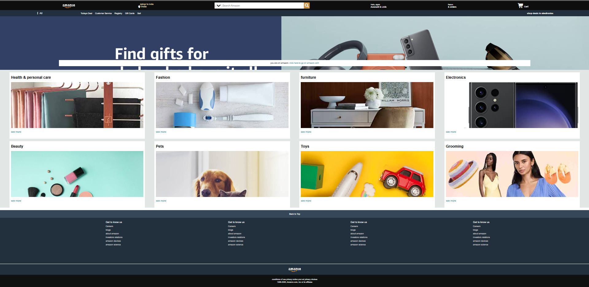

# 🛒 Amazon Clone

A front-end clone of the Amazon homepage built using HTML and CSS.

---

## 🚀 Project Overview

This project is a static clone of the Amazon homepage UI.
It was built as part of my web development learning journey.

The goal of this project was to:
- Understand HTML structure
- Practice CSS styling
- Improve layout and positioning skills
- Learn how real-world websites are structured

---

## 🛠️ Tech Stack

- HTML5
- CSS3
- VS Code
- Git & GitHub

---

## ✨ Features

- Amazon-like navbar
- Product sections
- Footer design
- Clean layout structure

---

## 📂 How to Run Locally

1. Clone the repository
2. Open the project folder
3. Open `index.html` in your browser

---

## 📌 Learning Outcome

Through this project, I improved my understanding of:
- CSS Flexbox
- Layout design
- UI replication
- Git version control

---

## 👨‍💻 Author

Sarthak  
Aspiring Software Development Engineer 🚀
